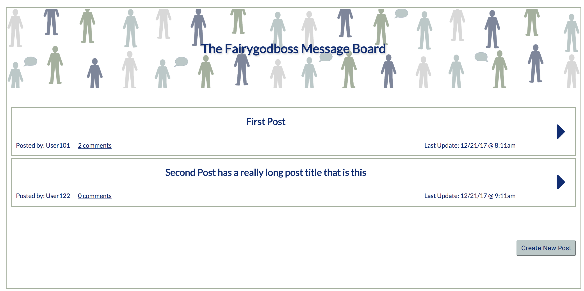

# Fairygodboss Message Board

## This is a React app message board. 

This project was bootstrapped with [Create React App](https://github.com/facebookincubator/create-react-app). 'create-react-app' is an npm package and React/webpack starter kit. It includes Webpack and Babel configuration. It also includes Autoprefixer, ESLint and Jest. See documentation for details. 

## Set up

After you have downloaded the app, run 'npm install' to retrieve dependencies. Next, to start up the application in your terminal, enter 'npm start'.

## Dependencies and Tools Used

In addition to 'create-react-app', these are used:

* react-addons-update (npm package)
* font awesome (icon library- web, available at fontawesome.com)
* SASS (CSS preprocessor)

## User Stories
* As a user, I should be able to see a Landing page with a welcome banner.
* As a user, I should be able to see a message of there are no posts. 
* As a user, I should be able to click 'Create New Post' button and see a form.
* As a user, I should be able create a new post, and view that new post.
* As a user, I should be able to see a post preview of all available posts from the landing page.
* As a user, I should be able to click on a post preview and see a full post. 
* As a user, I should be able see comments when on in a full post view.
* As a user, I should be able to add a new comment to a post.

